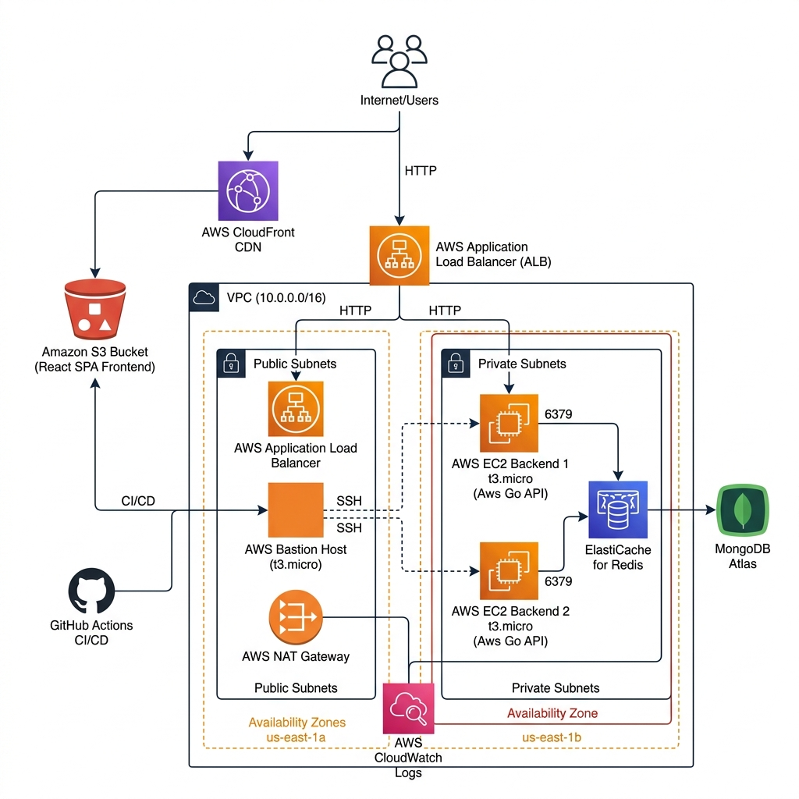

# Much-to-Do Infrastructure

Production-ready cloud infrastructure on AWS for the **Much-to-Do** task management application. Designed for high availability, security, and automation using Infrastructure as Code (Terraform).

## Architecture



### Components

| Layer | Technology | Purpose |
|-------|-----------|---------|
| **Frontend** | React SPA → S3 + CloudFront | Static site hosting with global CDN |
| **Backend** | Go (Gin) → EC2 x2 behind ALB | RESTful API with auto-failover |
| **Database** | MongoDB Atlas | Managed document database |
| **Cache** | ElastiCache Redis | Session & data caching |
| **Networking** | VPC, Public/Private Subnets, NAT GW | Isolated network with internet access |
| **CI/CD** | GitHub Actions | Automated frontend & backend deployments |
| **Monitoring** | CloudWatch Agent + Logs | Centralized logging |

### Network Architecture

```
VPC: 10.0.0.0/16 (us-east-1)
├── Public Subnet 1 (10.0.101.0/24) - us-east-1a
│   ├── ALB
│   ├── Bastion Host
│   └── NAT Gateway
├── Public Subnet 2 (10.0.102.0/24) - us-east-1b
│   └── ALB
├── Private Subnet 1 (10.0.1.0/24) - us-east-1a
│   ├── EC2 Backend 1
│   └── ElastiCache Redis
└── Private Subnet 2 (10.0.2.0/24) - us-east-1b
    └── EC2 Backend 2
```

### Security Groups

| Security Group | Inbound | Outbound |
|---------------|---------|----------|
| **ALB SG** | HTTP/HTTPS from 0.0.0.0/0 | All traffic |
| **Backend SG** | Port 8080 from ALB SG, SSH from VPC | All traffic (via NAT GW) |
| **Redis SG** | Port 6379 from Backend SG | All traffic |
| **Bastion SG** | SSH from 0.0.0.0/0 | All traffic |

## Prerequisites

- [Terraform](https://www.terraform.io/) >= 1.0
- AWS CLI configured with appropriate credentials
- MongoDB Atlas account with a cluster and database user
- GitHub repository fork of [much-to-do](https://github.com/Innocent9712/much-to-do)

## Quick Start

### 1. Clone the Repository

```bash
git clone https://github.com/Tony542-ctrl/much-to-do-infra.git
cd much-to-do-infra
```

### 2. Set Up Terraform State Backend

```bash
# Create S3 bucket for state
aws s3api create-bucket --bucket much-to-do-tfstate-<ACCOUNT_ID> --region us-east-1

# Create DynamoDB table for locking
aws dynamodb create-table \
  --table-name much-to-do-tf-lock \
  --attribute-definitions AttributeName=LockID,AttributeType=S \
  --key-schema AttributeName=LockID,KeyType=HASH \
  --billing-mode PAY_PER_REQUEST
```

### 3. Create Key Pair

```bash
aws ec2 create-key-pair --key-name much-to-do-deploy --query 'KeyMaterial' --output text > much-to-do-deploy.pem
chmod 400 much-to-do-deploy.pem
```

### 4. Configure Variables

Create `terraform/terraform.tfvars`:

```hcl
mongo_uri       = "mongodb+srv://<user>:<pass>@<cluster>.mongodb.net/?retryWrites=true&w=majority"
db_name         = "muchtodo"
jwt_secret_key  = "<your-secret>"
```

### 5. Deploy

```bash
cd terraform
terraform init
terraform plan
terraform apply
```

### 6. Configure CI/CD

Set these GitHub Actions secrets on your app repository:

| Secret | Value |
|--------|-------|
| `AWS_ACCESS_KEY_ID` | IAM access key |
| `AWS_SECRET_ACCESS_KEY` | IAM secret key |
| `AWS_REGION` | `us-east-1` |
| `S3_BUCKET_NAME` | Terraform output: `s3_bucket_name` |
| `CLOUDFRONT_DISTRIBUTION_ID` | Terraform output: `cloudfront_distribution_id` |
| `EC2_HOST_1` | Terraform output: `backend_private_ips[0]` |
| `EC2_HOST_2` | Terraform output: `backend_private_ips[1]` |
| `BASTION_HOST` | Terraform output: `bastion_public_ip` |
| `SSH_PRIVATE_KEY` | Contents of `much-to-do-deploy.pem` |

## Repository Structure

```
much-to-do-infra/
├── terraform/
│   ├── provider.tf          # AWS provider & state backend config
│   ├── variables.tf         # Input variable definitions
│   ├── vpc.tf               # VPC, subnets, IGW, NAT Gateway
│   ├── security-groups.tf   # Security group rules
│   ├── ec2.tf               # Backend EC2 instances & bastion
│   ├── alb.tf               # Application Load Balancer
│   ├── elasticache.tf       # Redis cache cluster
│   ├── s3-cloudfront.tf     # S3 bucket & CloudFront distribution
│   ├── iam.tf               # IAM roles & policies
│   ├── cloudwatch.tf        # CloudWatch log groups
│   ├── outputs.tf           # Output values
│   └── terraform.tfvars     # Sensitive variable values (git-ignored)
├── scripts/
│   ├── user-data.sh         # EC2 bootstrap script
│   └── deploy-backend.sh    # Backend deployment helper
└── README.md
```

## Terraform Outputs

| Output | Description |
|--------|-------------|
| `cloudfront_domain_name` | Frontend URL |
| `alb_dns_name` | Backend API URL |
| `bastion_public_ip` | SSH jump host |
| `backend_private_ips` | Backend instance IPs |
| `redis_endpoint` | ElastiCache endpoint |
| `nat_gateway_eip` | NAT Gateway public IP (whitelist in MongoDB Atlas) |

## Key Design Decisions

1. **Private Subnets for Backend**: EC2 instances are not directly accessible from the internet, only via ALB or bastion SSH.
2. **NAT Gateway**: Allows private instances to access the internet (for MongoDB Atlas, Go packages) without being exposed.
3. **2GB Swap**: Go compilation requires ~1.8GB RAM; t3.micro only has 1GB, so swap is essential.
4. **Go 1.25.1**: Matches the project's go.mod to avoid automatic toolchain downloads that waste disk space.
5. **30GB Root Volume**: Accommodates swap file, Go toolchain, and build artifacts.

## Monitoring

Backend logs are streamed to CloudWatch via the CloudWatch Agent:
- **Log Group**: `/much-to-do/backend`
- **Log Streams**: One per EC2 instance (named by instance ID)
- **Retention**: 14 days

## High Availability

- **2 EC2 instances** across 2 Availability Zones
- **ALB** automatically routes traffic to healthy instances
- **Health checks** every 30 seconds on `/health` endpoint
- **Auto-failover**: If one instance goes down, ALB routes all traffic to the remaining healthy instance
